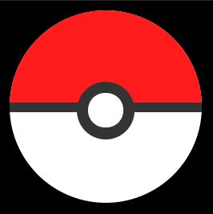

Poké Ball diseñada con HTML y CSS.

¿Contendrá algún Pokémon?

Podéis visualizarla aquí: https://mogedano.github.io/pokeball/.

Basada en el tutorial de DevCode: https://www.youtube.com/watch?v=6rsvaqiBZlo&t=1s&ab_channel=DevCode.
